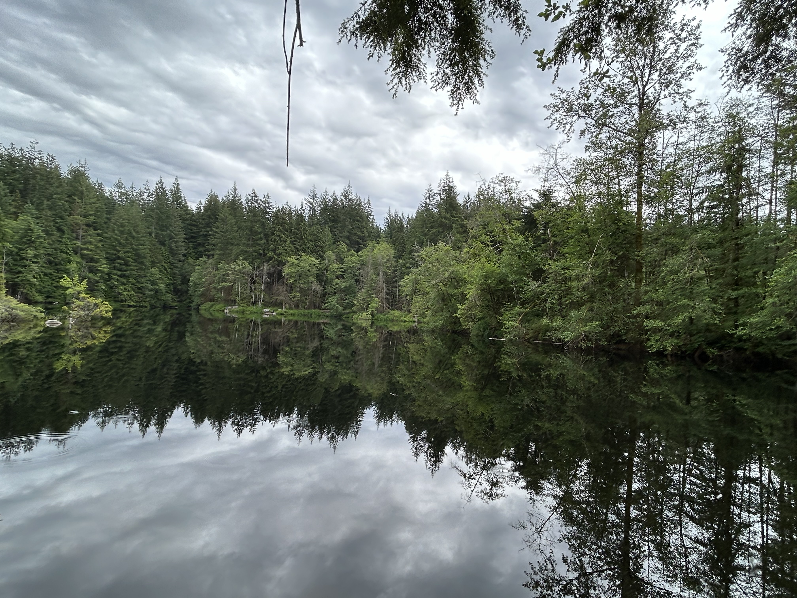
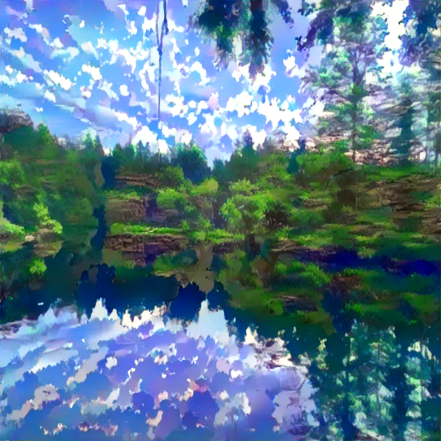
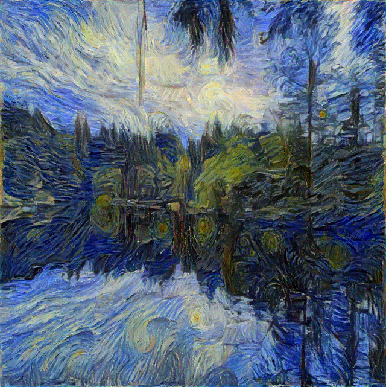

# Neural Style Transfer

This repository contains an implementation of the Neural Style Transfer (NST) algorithm, which uses deep learning and optimization to combine the content of one image with the style of another image to create a new image. NST leverages pre-trained Convolutional Neural Networks (CNNs) to achieve this transformation.

## Overview

Neural Style Transfer is an algorithm that takes two images, a content image, and a style image,  and blends them together so that the output image looks like the content image, but painted in the style of the style image.

<!-- ### How it works

1. **Content Representation**: This is done by using a pre-trained CNN (typically VGG-19) to extract the high-level features of the content image. These features are responsible for the overall structure and objects in the image.
2. **Style Representation**: The style of an image is captured by computing the Gram matrix of the features extracted from the style image. The Gram matrix captures the correlations between different feature maps, representing textures and patterns.
3. **Optimization**: The algorithm starts with the content image (or a white noise image) and iteratively adjusts it to minimize the content loss (difference from the content image) and the style loss (difference from the style image), resulting in an output image that combines both content and style. -->

## Examples

### Example 1

#### Content Image


#### Style Image


#### Output Image


### Example 2

#### Content Image


#### Style Image


#### Output Image



<!-- ## Usage

To run the Neural Style Transfer algorithm, you need to have Python and the required libraries installed. You can install the dependencies using:

```bash
pip install -r requirements.txt -->
